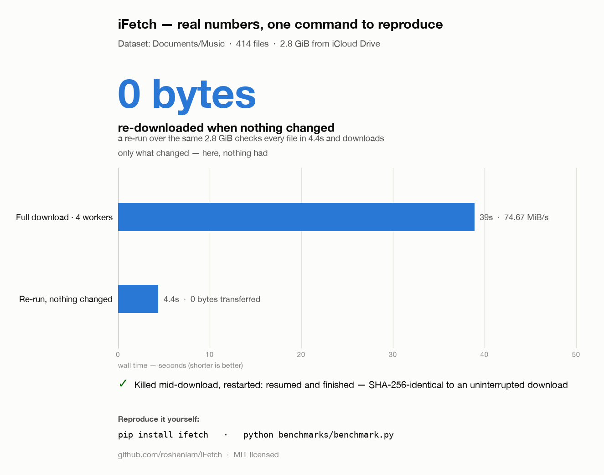

# iFetch

**Bulk-download your iCloud Drive from the command line — incremental re-runs, resumable transfers, integrity verification, version history, and a pipeline that mirrors iCloud to your NAS and Google Drive.**

[](https://github.com/roshanlam/iFetch/actions/workflows/ci.yml)
[](LICENSE)
[](https://www.python.org/)

Apple gives you two ways to get your data out of iCloud Drive: drag files around in Finder, or wait days for a privacy export. iFetch gives you a third: a scriptable CLI that downloads exactly what you want, skips files that haven't changed since the last run, resumes interrupted transfers, and keeps a local version history so an accidental overwrite in the cloud never costs you a file.

> **📹 Demo GIF coming soon** — a ~20-second `ifetch Documents ~/icloud-backup` run showing the skip-unchanged fast path and the summary report. *(placeholder — to be recorded)*

## Why iFetch?

**[rclone](https://rclone.org/iclouddrive/) is the serious alternative, and for many people the better choice.** It gained an iCloud Drive backend in v1.69.0 (January 2025), it uploads as well as downloads, and it reaches 70+ other clouds. If you want one tool for everything, use rclone. iFetch is deliberately narrow — download-only, iCloud-first — which is what lets it do a few things rclone's iCloud backend doesn't.

| | iFetch | [rclone](https://rclone.org/iclouddrive/) (iCloud backend) |
|---|---|---|
| Upload / delete / rename in iCloud | **Restore only** — `ifetch uplink` uploads files iCloud is missing; nothing else here can write, and nothing can delete or rename | **Yes** |
| Other cloud destinations | Google Drive only | **70+ backends** |
| Bidirectional sync | No (deliberate — see [Roadmap](#roadmap)) | **Yes** (`bisync`) |
| Mount / serve / crypt | No | **Yes** |
| Maturity | Young, single-maintainer | Mature project, but this backend is [Tier 4 "Experimental"](https://rclone.org/tiers/) and excluded from rclone's CI |
| Local version history + point-in-time restore | **Yes** (`ifetch-restore`) | No — deletes/overwrites go to iCloud Trash; no revision support |
| Apple package bundles (`.key`, `.pages`, `.numbers`, `.xcodeproj`) | **Restored as usable directories** (`--expand-packages`, on by default) | Transfer fails as "corrupted — sizes differ" and the file is deleted; `--ignore-size` leaves a ZIP named `Deck.key` ([#8404](https://github.com/rclone/rclone/issues/8404), [#8176](https://github.com/rclone/rclone/issues/8176), open since early 2025) |
| Offline integrity proof | **Yes** — signed `.ifetch_manifest.json` of SHA-256 digests; `ifetch-verify --offline` detects bit-rot years later with no credentials | No — Apple exposes no hashes, so verification is size-only |
| Headless / cron / Docker 2FA | **Yes** — `--2fa-code`, `$IFETCH_2FA_CODE`, watched file, or webhook | Interactive config only ([#9120](https://github.com/rclone/rclone/issues/9120)) |
| Proactive session-expiry warning | **Yes** — `ifetch auth status` exits non-zero *before* the ~30-day token dies | No — you find out when a run fails |
| Authentication diagnostics | **Yes** — `ifetch auth doctor` names the cause and the fix | Raw Apple errors (`HTTP 423 Missing PCS cookies`) |
| China Mainland (GCBD) accounts | **Yes** — `--region china` | Not supported; [#8257](https://github.com/rclone/rclone/issues/8257) open since Dec 2024 with two unmerged PRs |
| Folders shared by another Apple ID | Best-effort (see caveats below) | Share root only; operations inside fail ([#9477](https://github.com/rclone/rclone/issues/9477), fix unmerged) |
| Content hashes from Apple | None available (Apple exposes none) | None — so `--checksum` silently degrades to size-only |
| Advanced Data Protection | **Yes** — PCS-cookie flow with bounded, headless-safe approval polling; `auth doctor` names *which* ADP precondition failed. Validated against recorded responses, not a live ADP account | **Yes**, since v1.74.3 (June 2026) |
| Files evicted by "Optimize Mac Storage" | **`ifetch guard`** — reports the bytes that exist only on Apple's servers and are therefore missing from every Time Machine / Backblaze / Arq / rsync backup, and downloads them back | Not addressed — rclone does not inspect local FileProvider state |
| Noticing files deleted *in iCloud* before Trash purges them | **`ifetch vanish`** — classifies what went missing, bounds the ~30-day purge deadline, and refuses to call a broken scan a mass deletion | No — `sync` propagates the deletion to your local copy |
| Graphical interface | **Yes** — `ifetch serve`, a local web UI, no extra dependencies | No — third-party GUIs only; a GUI is the [most-discussed request](https://forum.rclone.org/top?period=yearly) on their forum |
| Restoring files back into iCloud | **`ifetch uplink`** — uploads only what iCloud is missing; never overwrites, deletes or renames | Yes, but as general two-way sync, with the deletion semantics that implies |
| Bandwidth limiting | **Yes** (`--bwlimit`, rclone-compatible timetables) | **Yes** |
| Dead-man's-switch / push notifications | **Yes** — Healthchecks.io, ntfy, webhooks, with anomaly distinct from failure | Via external tooling |
| Container image | **Yes** — GHCR, session-persisting volume layout | **Yes** |
| iCloud → NAS → Google Drive in one command | Yes (`ifetch-mirror --watch`) | Composable, but not a single command |

Two honest caveats about the columns above:

- **ADP: implemented, but not verified against a live ADP account.** iFetch now performs Apple's PCS-cookie flow (`requestWebAccessState` → device consent → bounded `requestPCS` polling), persists the cookie in the same session store as everything else so unattended re-runs need no re-approval, and names each ADP failure specifically — "Access iCloud Data on the Web is off", "approval not tapped on a trusted device", "session has no web-auth cookie" — instead of relaying `HTTP 423`. Use `ifetch auth renew --adp` and `ifetch auth doctor --online --adp`. **Caveat:** turning ADP on requires a physical device and a recovery key, so this path is pinned by a [contract-test harness](https://github.com/roshanlam/iFetch/blob/main/tests/test_adp.py) replaying Apple's recorded responses — the same approach as shared folders — and has *not* been run against a real ADP-enabled Apple ID. Where iFetch cannot tell whether ADP is enabled it reports "could not determine" rather than guessing. Treat it as implemented-and-tested-by-replay, not field-proven.
- **Shared folders**: the root cause of the long-standing failure here is now fixed rather than worked around. Apple puts `shareID` on the share *root* and omits it from the items it returns for that root's children, while every layer that needs share scope — pyicloud's `get_children()`, iFetch's download fallback — reads it off the node it is holding. The identifier was therefore lost one level down, and from there every request went out unscoped: HTTP 400 on the next listing, `WSObjectNotFound` on every file. That is the same defect that confines rclone's iCloud backend to the share root ([#9477](https://github.com/rclone/rclone/issues/9477), fix unmerged). iFetch now carries share context down the tree and seeds it into the exact key pyicloud reads, so nested listings and downloads both work. **This is still pinned by a [contract-test harness](https://github.com/roshanlam/iFetch/blob/main/tests/test_shared_folder_contract.py) replaying recorded responses, not by a live run** — recorded responses only prove iFetch branches correctly on the payloads we believe Apple sends. [`docs/shared-folder-validation.md`](https://github.com/roshanlam/iFetch/blob/main/docs/shared-folder-validation.md) is the 15-minute procedure against a real cross-account share; until someone runs it, treat this as fixed-in-principle.

For **photos**, use [icloudpd](https://github.com/icloud-photos-downloader/icloud_photos_downloader) — it is far more mature than iFetch's own brand-new `ifetch-photos`, which has not yet been validated against a live account.

## 60-second quickstart

```sh
# 1. Install
pip install "ifetch[gdrive,auth]"   # core + Google Drive export + auth CLI (or: pip install ifetch)

# 2. Store your iCloud password in the system keyring (one time)
icloud auth login --username you@example.com

# 3. Download a folder (you'll be prompted for a 2FA code on first run)
ifetch Documents ~/icloud-backup
```

**Prefer not to use a terminal?** `ifetch serve` opens a small web UI instead:

```sh
ifetch serve
#   iFetch web UI: http://127.0.0.1:8765/?t=<token>
```

Open that link and everything below happens in a browser — signing in (2FA included), picking a folder, watching the download, and reading the two reports. It binds to localhost only, needs no new dependencies, and works fine on a headless NAS over an SSH tunnel. See [docs/webui.md](https://github.com/roshanlam/iFetch/blob/main/docs/webui.md).

That's it. Run the same command tomorrow and iFetch skips every file that hasn't changed — on an untouched folder that means zero bytes transferred and, thanks to the metadata fast path, zero network round-trips per file.

To work from source instead:

```sh
git clone https://github.com/roshanlam/iFetch.git
cd iFetch
pip install -e ".[gdrive]"
```

> **Note on pyicloud:** iFetch is built on [pyicloud](https://github.com/timlaing/pyicloud), which is actively maintained again on PyPI (v2.5.0+ adds the shared-drive support iFetch relies on). It is installed automatically.

## Three commands to know

Most of iFetch is recovery tooling you reach for when something has gone wrong. Day to day, three commands cover it.

**1. Download a folder and keep it in sync**

```sh
ifetch Documents ~/icloud-backup
```

Re-run it tomorrow and unchanged files are skipped entirely — zero bytes, and thanks to the metadata fast path, zero network round-trips per file.

**2. Mirror iCloud → NAS → Google Drive in one command**

```sh
ifetch-mirror Documents /Volumes/nas/icloud --gdrive-folder "iCloud Mirror" --watch 900
```

Delta-aware at both hops; `--watch` repeats the pipeline on an interval.

**3. Finish a download that was interrupted**

```sh
ifetch resume ~/icloud-backup      # re-fetch only the files that didn't finish
ifetch repair  ~/icloud-backup     # offline: report what was left behind
```

A run cut off mid-transfer — closed laptop, dropped connection, power cut — resumes without starting over, and without re-listing your whole drive.

Everything else — planning, auditing, snapshots, conflict detection, recovery, uploads, the web UI — is in the [full command reference](#full-command-reference).

## Features

- **Web UI** — `ifetch serve` for sign-in, browsing, downloading and the reports, without touching a terminal ([docs/webui.md](https://github.com/roshanlam/iFetch/blob/main/docs/webui.md))
- **Backup-exposure report** — `ifetch guard` names the bytes that exist only on Apple's servers because "Optimize Mac Storage" evicted them, and that every backup of your Mac is therefore silently skipping; `--materialize --apply` pulls them back ([details](#what-your-backups-are-missing))
- **Deletion alerting** — `ifetch vanish` finds files that disappeared from *iCloud* while the cloud copy is still inside the ~30-day Trash window, and refuses to mistake a failed scan for a mass deletion
- **Secure authentication** — password lives in your OS keyring (via pyicloud), full 2FA/2SA support, trusted sessions so you are not re-prompted every run
- **Advanced Data Protection** — Apple's PCS-cookie flow with bounded, headless-safe approval polling (tested by replay, not against a live ADP account)
- **Bandwidth limiting** — `--bwlimit` with rclone-compatible timetables, applied to the whole run rather than per worker
- **Monitoring** — Healthchecks.io, ntfy and webhook notifications, with anomalies kept distinct from failures ([docs/monitoring.md](https://github.com/roshanlam/iFetch/blob/main/docs/monitoring.md))
- **Container image** — multi-stage, non-root, session-persisting ([docs/docker.md](https://github.com/roshanlam/iFetch/blob/main/docs/docker.md))
- **Headless-friendly 2FA** — supply the code with `--2fa-code`, `$IFETCH_2FA_CODE`, a watched file or a webhook, so cron/Docker/NAS runs never hang on a prompt ([details](#authentication-that-survives-a-headless-box))
- **Authentication diagnostics** — `ifetch auth doctor` says *which precondition failed* and how to fix it, instead of relaying `HTTP 423 Missing PCS cookies`
- **Proactive expiry warnings** — Apple's trust token lasts ~30 days; `ifetch auth status` exits non-zero days *before* it dies rather than after a backup fails
- **Apple package bundles restored** — `.key`/`.pages`/`.numbers`/`.xcodeproj` come back as usable directories instead of ZIP blobs ([details](#apple-package-bundles))
- **Offline integrity proof** — a signed `.ifetch_manifest.json` of SHA-256 digests lets `ifetch-verify --offline` detect bit-rot years later with no credentials ([details](#proving-a-backup-is-still-intact))
- **China Mainland support** — `--region china` for Apple IDs served by iCloud.com.cn
- **Incremental sync** — unchanged files are skipped entirely and interrupted downloads resume from where they stopped (see [How re-runs decide what to download](#how-re-runs-decide-what-to-download) for exactly what "unchanged" means)
- **Metadata fast path** — a re-run skips known-unchanged files with **zero network round-trips**, using the `.ifetch_state.json` sync-state file in the destination
- **Integrity verification** — `ifetch-verify` re-checks a local mirror against iCloud without modifying a single file
- **Resume-capable** — checkpointed downloads pick up where they left off after an interruption
- **Parallel downloads** — configurable worker pool (`--max-workers`)
- **Retries with exponential backoff** — transient 5xx/timeout errors are retried, `Retry-After` headers respected
- **Version history** — before overwriting a changed file, the previous copy is archived to a local `.versions/` directory (see [Version history](#version-history--rollback))
- **Shared items** — list and download files/folders shared *with* you (`--list-shared`)
- **Profiles** — named include/exclude pattern sets for repeatable sync jobs
- **Plugins** — hook into auth, listing, and download lifecycle events ([docs/plugins.md](https://github.com/roshanlam/iFetch/blob/main/docs/plugins.md))
- **Structured JSON logging** and a per-run `download_report.json` summary
- **Google Drive export** (`ifetch-export`) and an **iCloud → NAS → Google Drive mirror** (`ifetch-mirror`)

## How re-runs decide what to download

This is the part people most often get wrong about backup tools, so here is exactly what iFetch does — no more, no less.

### Step 1: the metadata fast path (no network)

At the start of a run, iFetch reads `.ifetch_state.json` from the destination root. That file was written by previous runs and records, per file, the remote size and remote modified timestamp Apple reported, plus the local size and mtime at the moment the download completed.

A file is skipped **without touching the network at all** only when *every* one of these agrees:

- the remote node exposes both a size and a modified timestamp;
- both match what was recorded for that path;
- the recorded local size matches the remote size;
- the local file still exists with exactly that size;
- no leftover `.temp` / `.download` artifact is sitting next to it.

Any doubt at all — missing metadata, no recorded entry, a size that moved, a partial-download artifact — and iFetch falls through to the full network check. The fast path can only ever *skip* work; it can never cause a file to be skipped that a network check would have downloaded.

Why it matters: previously every file cost a full HTTPS open just to read its `content-length`, even when nothing had changed — roughly 39 ms per file, which is over an hour of pure round-trips on a 100k-file drive.

Turn it off with `--no-fast-scan` (forces a network check per file) or bypass all skip logic with `--force` (re-downloads everything).

Honest caveats:

- It trusts Apple to update `dateModified` when a file changes. If Apple doesn't, iFetch won't notice — though note the size comparison in step 2 would not have noticed a same-size edit either.
- **Local** corruption at the same file size is not detected. That is what [`ifetch-verify`](#ifetch-verify--read-only-integrity-checking) is for.
- Two concurrent `ifetch` runs against the same destination can clobber each other's state file. The consequence is extra network checks on the next run — never a false skip.

### Step 2: the network check (size comparison + prefix resume)

When a file does not qualify for the fast path, iFetch opens the remote file and compares `content-length` against the local file:

| Situation | What happens |
|---|---|
| Remote size == local size | **Skipped.** Assumed unchanged; zero bytes transferred. |
| Local file is a shorter prefix (an interrupted download) | **Resumed** from that offset — only the missing tail is fetched. |
| Local file is absent, empty, or any other size | **The entire file is re-downloaded.** |

### What iFetch does *not* do

iFetch does **not** perform content-based chunk diffing. There is no rolling hash, and no per-chunk digests are compared against iCloud — Apple exposes none, and the download stream is not seekable. Two consequences you should know about before trusting it with your data:

- **Editing one byte in the middle of a 2 GB file re-downloads all 2 GB.** The size changed (or didn't), so the whole file is re-fetched; there is no byte-range delta.
- **A modification that leaves the file size unchanged is not detected.** Size comparison cannot see it, and the fast path only catches it if Apple bumped the modified timestamp. If you need certainty, run [`ifetch-verify`](#ifetch-verify--read-only-integrity-checking) at `--level redownload`.

Genuine content-based chunk diffing is a [roadmap](#roadmap) item for 1.1.

## What your backups are missing

Turn on "Optimize Mac Storage" and iCloud Drive stops being a folder that happens to sync. It becomes a non-replicating FileProvider, and macOS is free to evict any file's contents whenever it wants the space back — leaving the name, the icon, the modification date and the **size** in place. Finder shows a 4 GB video. The directory entry says 4 GB. The disk holds nothing.

Everything that copies files by reading them inherits that:

- **Time Machine** backs up the placeholder, not the file.
- **Backblaze, Arq, Carbon Copy Cloner, rsync to a NAS** read zero bytes and report success.

Nothing fails at backup time, because nothing *did* fail at backup time. It fails at restore time, when the file comes back empty and the original is gone. Every byte total and every checksum computed over such a tree is wrong, and wrong in the direction that reads as safe.

```sh
ifetch guard                     # how much of ~/Library/Mobile Documents is not really here
ifetch guard --materialize       # what pulling it back would fetch (dry run)
ifetch guard --materialize --apply
```

`guard` fetches the missing bytes from iCloud's servers directly, bypassing the FileProvider — which is the whole reason iFetch can fix this rather than merely report it. It exits non-zero when anything is evicted *or* when it could not fully examine the tree, so it is usable from a monitoring job.

Two things it will not do:

- **It will not call a folder clean if it could not check it properly.** The zero-blocks test only works on macOS, so on Linux and Windows the report names the check it skipped instead of printing a reassuring zero. Folders it could not read are listed, symlinks are never followed, and files whose stub recorded no size are counted apart from the rest — the headline then calls itself a floor rather than a total.
- **It will not take an exit code's word for it.** `brctl download` reports success for work it has only queued and may later drop. Every file is re-checked afterwards, and anything still missing is named.

## Benchmarks

Measured against a real iCloud Drive folder (414 files, 2.8 GiB) on a residential connection, July 2026:

| Scenario | Time | Result |
|---|---|---|
| Full download (4 workers) | 38.9s | 74.7 MiB/s |
| Re-run, nothing changed | **4.4s** | **0 bytes re-transferred** |
| Killed mid-download, restarted | +4.5s to finish | final tree **SHA-256-identical** to an uninterrupted download |



The re-run row is the one that matters: 2.8 GiB checked in 4.4 seconds with nothing transferred. Before the metadata fast path the same re-run took 16.2s, because every file cost an HTTPS round-trip just to read its `content-length`.

The resume row is a correctness result, not a speed one — the harness kills a download mid-flight, restarts it, and SHA-256-compares every file against an uninterrupted run.

Throughput varies with your connection and with Apple's rate limiting; more workers is not reliably faster (8 workers measured both faster *and* slower than 4 across runs). 4 is a sensible default.

Don't take these numbers on faith — the harness ships in the repo:

```sh
python benchmarks/benchmark.py "Documents/SomeFolder" --email you@example.com --workers 4 8
```

## Full command reference

<details>
<summary><b>Expand — every command, with flags and defaults verified against <code>--help</code></b></summary>

The core downloader is `ifetch`. Around it is a family of focused tools that share the same on-disk index, sync state and signed manifest.

**Download & upload**

| Command | Purpose |
|---|---|
| `ifetch` | Download / list iCloud Drive content locally |
| `ifetch-photos` | Download the iCloud **Photos** library (delta-aware, resumable) |
| `ifetch-mirror` | One-way pipeline: iCloud → local folder / NAS → Google Drive |
| `ifetch-export` | Upload local folders to Google Drive (skips unchanged files) |
| `ifetch uplink` | Upload files **missing** from iCloud — never overwrites, renames or deletes |

**Look before / after a run**

| Command | Purpose |
|---|---|
| `ifetch plan` | Dry run: what a download would fetch, overwrite and skip, and whether the disk fits |
| `ifetch audit` | Reconcile what exists in iCloud against what is on disk (exits non-zero on any difference) |
| `ifetch-verify` | Read-only integrity check against iCloud, or **offline** against the signed manifest |

**Recovery & repair**

| Command | Purpose |
|---|---|
| `ifetch recover` | `placeholders` / `missing` / `inventory` — what is not really on disk, and where the space went |
| `ifetch snapshot` | Dated states of a mirror; `diff` and `restore` by digest |
| `ifetch conflicts` | `renames` / `duplicates` / `moves` — the same bytes under a new name, so they are not fetched or stored twice |
| `ifetch repair` | What an interrupted run left behind — unfinished transfers, stray partials, digest mismatches |
| `ifetch resume` | Finish only the unfinished transfers, without re-listing the whole drive |
| `ifetch-restore` | Roll a file (or a whole tree) back to a version iFetch archived before overwriting it |
| `ifetch guard` | Find local files that exist **only** on Apple's servers and are absent from every backup of this machine |
| `ifetch vanish` | Detect files that have disappeared from iCloud since a previous scan |

**Auth, sharing, serving**

| Command | Purpose |
|---|---|
| `ifetch auth` | `doctor` / `renew` / `status` — diagnose, renew and inspect the session |
| `ifetch sharecheck` | Validate iFetch against a folder shared by another Apple ID (read-only) |
| `ifetch serve` | Run the local web UI ([docs/webui.md](https://github.com/roshanlam/iFetch/blob/main/docs/webui.md)) |

Everything shown as `ifetch <subcommand>` above is **also** installed as a hyphenated alias — `ifetch plan` and `ifetch-plan` are the same command. The five standalone tools (`ifetch-photos`, `ifetch-verify`, `ifetch-restore`, `ifetch-export`, `ifetch-mirror`) are invoked only in their hyphenated form. Full per-command references for the core downloader, verify, export and mirror follow; the recovery family is documented under [What your backups are missing](#what-your-backups-are-missing) and each command's `--help`.

### `ifetch` — iCloud Drive downloader

```sh
ifetch <icloud_path> [local_path] [options]
```

| Argument / flag | Description | Default |
|---|---|---|
| `icloud_path` | Remote iCloud Drive path, e.g. `Documents/MyFolder`. Required unless `--list-shared` | — |
| `local_path` | Local destination directory | current directory |
| `--email` | iCloud account email (or set `ICLOUD_EMAIL`) | env var / error |
| `--max-workers N` | Concurrent download threads | `4` |
| `--max-retries N` | Retry attempts for failed chunks (exponential backoff) | `3` |
| `--chunk-size BYTES` | Size of the byte ranges requests are split into | `1048576` (1 MiB) |
| `--no-fast-scan` | Bypass `.ifetch_state.json`; open every file over the network to check its size | fast path on |
| `--force` | Re-download every file regardless of local state or size match | off |
| `--log-file PATH` | Write structured JSON logs to a file | console only |
| `--list` | List directory contents instead of downloading | off |
| `--list-shared` | List top-level items shared *with* you (no path needed) | off |
| `--profile NAME` | Apply include/exclude patterns from a profile | no filter |
| `--profile-file PATH` | Custom profile JSON path | `~/.ifetch_profiles.json` |
| `--region {global,china}` | Which Apple endpoints to use; `china` switches everything to iCloud.com.cn | `$ICLOUD_REGION`, else `global` |
| `--no-expand-packages` | Write Apple package bundles as the raw ZIP Apple serves instead of expanding them | expansion on |
| `--sign-key KEY` / `--sign-key-file PATH` | HMAC key used to sign `.ifetch_manifest.json` | `$IFETCH_MANIFEST_KEY`, else unsigned |
| `--2fa-code CODE` | Six-digit 2FA code, for headless runs | prompt if a TTY |
| `--2fa-file PATH` | Poll a file until it contains a code | — |
| `--2fa-webhook URL` | Poll a URL (GET) until the response contains a code | — |
| `--2fa-timeout SECONDS` | How long to wait for a polled code | `300` |
| `--warn-days N` | Warn before starting if the session expires within N days | `7` |
| `--password-command CMD` | Shell-free command that prints the Apple ID password on stdout, for boxes with no keyring | `$IFETCH_PASSWORD_COMMAND` |
| `--bwlimit RATE\|TIMETABLE` | Cap total download bandwidth, rclone-style: one rate (`512k`, `10M`) or a weekday-aware timetable. Binary units, bare number = KiB/s, `off`/`0` = unlimited. Applies to the whole run and is re-read as the clock crosses a boundary | unlimited |
| `--no-notify` | Send no run-outcome notifications even if the environment configures them | notifications off unless configured |

**Run-outcome notifications.** `ifetch` can ping a dead-man's switch and push a success/failure/anomaly message at the end of a run. Configure a [Healthchecks](https://healthchecks.io) check (`--healthchecks-url` or `--healthchecks-uuid` [`--healthchecks-base-url`]), an [ntfy](https://ntfy.sh) topic (`--ntfy-url`, or `--ntfy-topic` [`--ntfy-server`/`--ntfy-token`/`--ntfy-priority`/`--ntfy-tags`]), or a generic JSON webhook (`--webhook-url`, `--webhook-header KEY:VALUE`). `--notify-timeout` and `--notify-retries` tune delivery. Every flag has an environment-variable equivalent — see [docs/monitoring.md](https://github.com/roshanlam/iFetch/blob/main/docs/monitoring.md).

Environment variables: `ICLOUD_EMAIL` (account email), `ICLOUD_REGION=china` (or the legacy `ICLOUD_CHINA=true`), `IFETCH_2FA_CODE` (two-factor code), `IFETCH_MANIFEST_KEY` (manifest signing key), `IFETCH_PASSWORD_COMMAND` (password command), `IFETCH_PLUGIN_PATH` (extra plugin directory), plus the `IFETCH_HEALTHCHECKS_*`, `IFETCH_NTFY_*` and `IFETCH_WEBHOOK_*` notification variables documented in [docs/monitoring.md](https://github.com/roshanlam/iFetch/blob/main/docs/monitoring.md).

Examples:

```sh
ifetch Documents --list                          # list a folder
ifetch --list-shared --email you@example.com     # list items shared with you
ifetch Documents/Photos ~/Downloads/icloud-photos
ifetch Documents/Programming ~/Work/Code \
  --email you@example.com --max-workers 8 --max-retries 5 --log-file download.log
```

After each download run, a summary is printed and a detailed `download_report.json` is written into the destination directory. The summary includes a `skipped` count (files proven unchanged, by either the metadata fast path or the size comparison); those files appear in the report details with `status="skipped"` and `downloaded: 0`.

iFetch also writes `.ifetch_state.json` into the destination root — the sync state that makes the next run cheap. Deleting it is safe: the next run just falls back to a network check per file. Two concurrent `ifetch` runs against the same destination can overwrite each other's state file; the effect is extra network checks on the following run, never a false skip.

### `ifetch-verify` — read-only integrity checking

```sh
ifetch-verify <icloud_path> [local_path] [options]
```

Walks the remote tree, compares it against your local copy, and reports per file. **It never modifies your files** — local files are opened read-only, and in `redownload` mode remote bytes are hashed in memory and never written to disk. The only thing it can write is the JSON report, at the path you pass to `--report`.

| Argument / flag | Description | Default |
|---|---|---|
| `icloud_path` | Remote iCloud Drive path to verify | — (required) |
| `local_path` | Local directory holding the mirror | current directory |
| `--email` | iCloud account email (or set `ICLOUD_EMAIL`) | env var |
| `--level size\|checksum\|redownload` | Verification depth — see below | `size` |
| `--max-workers N` | Files verified concurrently | `4` |
| `--report PATH` | Write a JSON verification report | none |
| `--quiet` | Suppress per-file progress output | off |

Exit codes: `0` everything verified, `1` at least one file failed verification, `2` operational error (auth failure, bad path, unwritable report, cancelled).

#### Which level actually proves what

| Level | What it does | What it proves | Cost |
|---|---|---|---|
| `size` (default) | Compares the remote size attribute with the local file size | Files are present and the right length. **Cannot detect corruption that preserves the file size.** | No content read, no bytes transferred |
| `checksum` | Everything `size` does, plus SHA-256 of your local files | Nothing extra *against iCloud* — see below | Reads every local byte |
| `redownload` | Streams every remote file and compares its SHA-256 against the local file's | **Byte-for-byte equality with iCloud.** This is the only level that actually proves your local copy matches. | Re-downloads the entire dataset |

**Be clear about `--level checksum`:** Apple exposes **no content checksum** for iCloud Drive items. Verified against pyicloud 2.6.5 — the drive node metadata carries `size`, `etag`, `dateModified`/`dateChanged` and identifiers, but no digest, and `etag` is a mutation counter (e.g. `"3::5"`), not a content hash. So `checksum` hashes your local file, finds nothing to compare it to, and honestly reports `checksum_unavailable` rather than claiming a match it cannot prove. That is **not** a failure and does not affect the exit code. The level is still useful for building a local manifest and catching local bit-rot between runs — but it does not verify anything against Apple. If you want that assurance, you have to pay for `redownload`.

#### Report statuses

| Status | Meaning | Counts as failure? |
|---|---|---|
| `verified` | Passed at the requested level | No |
| `size_mismatch` | Local and remote sizes differ | Yes |
| `missing_local` | In iCloud, not on disk | Yes |
| `checksum_mismatch` | Digests differ (`redownload`, or `checksum` if Apple ever publishes one) | Yes |
| `error` | The file could not be checked | Yes |
| `checksum_unavailable` | Local digest recorded; iCloud publishes no digest to compare against | No |
| `extra_local` | On disk, not in iCloud — reported for information (iFetch's own artifacts and `.versions/` are excluded) | No |

```sh
ifetch-verify Documents ~/icloud-backup --email you@example.com
ifetch-verify Documents ~/icloud-backup --level redownload --report verify.json --quiet
```

The same CLI is reachable as `python -m ifetch.verify ...` if the `ifetch-verify` entry point is not on your `PATH`.

### `ifetch-export` — local folders → Google Drive

```sh
ifetch-export [options]
```

Uploads local folders (by default `~/Documents`, `~/Downloads`, `~/Desktop`, `~/Pictures` — whichever exist) to a folder in your Google Drive, skipping anything that hasn't changed since the last run (MD5 + a local upload index). Asks for confirmation before uploading. Requires Google OAuth credentials — see [docs/mirror.md](https://github.com/roshanlam/iFetch/blob/main/docs/mirror.md) for the setup walkthrough.

| Flag | Description | Default |
|---|---|---|
| `--folders PATH...` | Folders to export | Documents, Downloads, Desktop, Pictures |
| `--gdrive-folder NAME` | Destination folder name in Google Drive | `MacOS Data` |
| `--credentials PATH` | Google OAuth2 client credentials JSON | `credentials.json` |
| `--token PATH` | Where the OAuth token is cached (JSON, mode 0600) | `.gdrive_token.json` |
| `--force` | Re-upload everything, even unchanged files | off |
| `--include PAT...` | Only upload files matching patterns (e.g. `*.pdf *.docx`) | all |
| `--exclude PAT...` | Skip files matching patterns (e.g. `*.tmp`) | none |
| `--chunk-size MB` | Resumable-upload chunk size in MB | `10` |
| `--upload-workers N` | Parallel upload workers (max recommended: 8) | `4` |
| `--ignore-file PATH` | `.gitignore`-style ignore file | `.gdriveexportignore` |
| `--no-ignore` | Ignore file disabled — upload everything | off |
| `--index-file PATH` | Upload-tracking index file | `.gdrive_upload_index.json` |
| `--no-index` | Disable the index (slower; rescans everything) | off |
| `--rebuild-index` | Clear the index and exit | off |
| `--show-index-stats` | Print index statistics and exit | off |
| `--list-defaults` | Print the default folder list and exit | off |

### `ifetch-mirror` — iCloud → NAS → Google Drive

```sh
ifetch-mirror <icloud_path> <local_path> --gdrive-folder NAME [options]
```

| Argument / flag | Description |
|---|---|
| `icloud_path` | Source path in iCloud Drive |
| `local_path` | Local staging folder — typically a NAS mount |
| `--gdrive-folder NAME` | Destination folder in Google Drive |
| `--watch SECONDS` | Keep running, repeating the pipeline on an interval |
| `--dry-run` | Show what would be transferred without transferring |
| `--email` | iCloud account email (or `ICLOUD_EMAIL`) |

See the [Mirror section](#mirror-icloud--nas--google-drive) below and the full guide in [docs/mirror.md](https://github.com/roshanlam/iFetch/blob/main/docs/mirror.md).

### Planning, auditing & recovery

These commands are built on a local SQLite index (`.ifetch_index.db`) that iFetch keeps in the destination. Most of them work **offline**, reusing the last scan, so they stay usable on a machine that can no longer sign in. Every one is read-only unless you pass `--apply`.

```sh
ifetch plan Documents ~/icloud-backup            # dry run: what a sync would fetch, and if the disk fits
ifetch audit Documents ~/icloud-backup           # what's in iCloud vs on disk (exit 1 on any difference)
ifetch recover missing ~/icloud-backup           # what iCloud has that this disk doesn't really have
ifetch recover placeholders ~/icloud-backup      # local files whose contents are only on Apple's servers
ifetch recover inventory ~/icloud-backup --top 25
ifetch snapshot create before-cleanup ~/icloud-backup
ifetch snapshot diff before-cleanup after-cleanup ~/icloud-backup
ifetch conflicts duplicates ~/icloud-backup      # byte-identical files stored more than once
ifetch conflicts renames ~/icloud-backup         # files iCloud offers as new that you already have renamed
ifetch conflicts renames ~/icloud-backup --apply # move them locally instead of re-downloading
```

- **`ifetch plan`** — how many files would be downloaded and overwritten, the byte total, whether the destination has enough free space (with headroom), what is skipped and why, and an estimated time. The estimate is produced **only** from throughput measured on previous runs or a value you pass with `--throughput`; with neither it is reported as unknown, never guessed. `--no-scan` reuses the last scan; `--rehash` re-hashes every local file to catch corruption. Transfers nothing.
- **`ifetch audit`** — the same reconciliation presented as "what exists remotely vs locally", exiting non-zero when the two disagree so it is usable from a monitoring job.
- **`ifetch recover`** — `placeholders` (files evicted to iCloud that hold no bytes locally; signals that can't be evaluated on the current OS are named, not silently skipped), `missing` (never-downloaded vs disappeared vs placeholder-only), `inventory` (space by folder / type / largest item, with `--csv` export).
- **`ifetch snapshot`** — `create`, `list`, `diff`, `restore`, `delete`. A snapshot is metadata, not a copy, so taking one is instant. `diff` compares two points in time **by digest**, so a same-size change is still caught. `restore` is a dry run by default and names files whose bytes exist nowhere rather than omitting them.
- **`ifetch conflicts`** — `duplicates` and `moves` are proved by digest; `renames` is inferred from name and size (Apple publishes no content hash) and graded `strong`/`weak`, with ambiguous matches listed rather than guessed. `renames --apply` moves local files instead of re-downloading; it re-checks the disk first, refuses to overwrite, and updates the index and manifest.

### Resuming & repairing an interrupted run

A download records durable per-file transfer state in the index, so a run killed mid-transfer — closed laptop, dropped link, power cut — can be finished without starting over.

```sh
ifetch repair ~/icloud-backup                    # offline: what was left unfinished
ifetch repair ~/icloud-backup --check-digests    # also re-hash to find corruption (reads the whole mirror)
ifetch repair ~/icloud-backup --apply            # queue the affected files for a fresh fetch
ifetch resume Documents ~/icloud-backup --email you@example.com
```

- **`ifetch repair`** — reports interrupted transfers, failures with their recorded reason, files that have failed repeatedly, stray `.temp`/`.download` artifacts, and (with `--check-digests`) files whose bytes no longer match the recorded digest. Read-only until `--apply`. iFetch cannot rebuild a missing tail locally, so `--apply` queues a fresh fetch; a proven-wrong partial is discarded rather than resumed from, and a digest mismatch is never silently overwritten.
- **`ifetch resume`** — re-fetches only the transfers the journal marks unfinished, opening each item directly instead of re-walking the drive. `--dry-run` lists them without contacting Apple.

### `ifetch guard` / `ifetch vanish` — what's slipping out of your backups

- **`ifetch guard [local_path]`** — with macOS "Optimize Mac Storage" on, files you haven't opened are evicted to iCloud and only a stub is left, so a Time Machine or `rsync` backup silently copies nothing. `guard` reports how much of a folder exists only on Apple's servers (default: `~/Library/Mobile Documents/com~apple~CloudDocs`). `--materialize` plans the re-download; `--apply` performs it (`--strategy auto|fetch|brctl`). `--csv` exports the evicted-file list.
- **`ifetch vanish check [local_path]`** — what a previous scan recorded that iCloud no longer lists (possible remote deletion or data loss). `ifetch vanish forget` drops recorded absences for paths you deleted on purpose.

### `ifetch-photos` — iCloud Photos

```sh
ifetch-photos ~/icloud-photos --folder-structure date --live-photos
```

Downloads the Photos library (originals by default), delta-aware and resumable. Key flags: `--album NAME`, `--since`/`--until DATE`, `--folder-structure {flat,year,date,day,album}` (default `date`), `--version {original,medium,thumb}`, `--live-photos`, `--include-deleted`, `--no-set-mtime`, `--list-albums`, `--dry-run`.

> Photos support is newer than the rest of iFetch and has not been validated against a live library at scale. For a mature, photos-first tool, use [icloudpd](https://github.com/icloud-photos-downloader/icloud_photos_downloader).

### `ifetch uplink` — upload files missing from iCloud

```sh
ifetch uplink plan Documents ~/icloud-backup     # what would be uploaded, and what is refused
ifetch uplink push Documents ~/icloud-backup     # dry run by default
ifetch uplink history Documents ~/icloud-backup
```

Uploads only files that are **absent** from iCloud. It never overwrites, renames or deletes anything already there — the safe, narrow complement to the download-only core.

### `ifetch sharecheck` / `ifetch serve`

- **`ifetch sharecheck <share_path>`** — validates iFetch against a folder shared by *another* Apple ID, including the nested-subdirectory case that breaks other clients. Read-only against iCloud. See [docs/shared-folder-validation.md](https://github.com/roshanlam/iFetch/blob/main/docs/shared-folder-validation.md).
- **`ifetch serve`** — runs the local web UI, binding `127.0.0.1:8765` and printing a URL that contains a one-time access token. `--allow-path DIR` widens the download destinations it will offer. See [docs/webui.md](https://github.com/roshanlam/iFetch/blob/main/docs/webui.md) and [docs/webui-api.md](https://github.com/roshanlam/iFetch/blob/main/docs/webui-api.md).

</details>

## Mirror: iCloud → NAS → Google Drive

A frequently requested workflow: keep a copy of your iCloud Drive on a NAS **and** in Google Drive, without re-transferring files that haven't changed. `ifetch-mirror` chains both hops into one command, skipping unchanged files at each stage:

```sh
# One shot: pull iCloud Documents to the NAS, then push to Google Drive
ifetch-mirror Documents /Volumes/nas/icloud-mirror --gdrive-folder "iCloud Mirror"

# Always-on: re-run the pipeline every 15 minutes
ifetch-mirror Documents /Volumes/nas/icloud-mirror \
  --gdrive-folder "iCloud Mirror" --watch 900

# Preview what would happen
ifetch-mirror Documents /Volumes/nas/icloud-mirror \
  --gdrive-folder "iCloud Mirror" --dry-run
```

- Hop 1 (iCloud → local) uses the `ifetch` download engine: unchanged files are skipped outright, interrupted transfers resume, and any file that did change is re-downloaded in full ([details](#how-re-runs-decide-what-to-download)).
- Hop 2 (local → Google Drive) uses the export engine's MD5 + upload index — only changed files are re-uploaded.
- `--watch` makes it a lightweight always-on daemon; alternatively schedule single runs with launchd/cron/systemd ([docs/scheduling.md](https://github.com/roshanlam/iFetch/blob/main/docs/scheduling.md)).

The pipeline is **one-way** (iCloud is the source of truth). Two-way sync is deliberately not implemented — see the [Roadmap](#roadmap).

## Authentication that survives a headless box

Authentication is the single biggest source of pain with iCloud tooling, and
almost all of it is one of three problems: an error that names no cause, a 2FA
prompt with no terminal to answer it, or a token that expired without warning.

### `ifetch auth doctor` — which precondition actually failed

```sh
ifetch auth doctor --email you@example.com            # local checks only
ifetch auth doctor --email you@example.com --online   # also probe Apple
ifetch auth doctor --email you@example.com --json     # machine-readable
```

It reports the region in use, whether a stored session exists and carries a
trust token, exactly how many days remain before it expires, and — with
`--online` — whether Apple accepts the session and whether iCloud Drive actually
responds. Apple errors are translated rather than relayed:

```
[FAIL] drive_access
       Apple refused the request for lack of PCS cookies. This account has
       Advanced Data Protection enabled, or 'Access iCloud Data on the Web' is
       turned off.
       -> On an Apple device: Settings > [your name] > iCloud > 'Access iCloud
          Data on the Web' must be ON. ...
```

Exit codes: `0` healthy, `1` needs attention soon, `2` broken now.

### Two-factor codes without a terminal

Under cron, Docker without `-it`, or systemd, `input()` does not prompt — it
hangs. iFetch takes a code from whichever of these is configured, in order:

```sh
ifetch Documents ~/backup --2fa-code 123456              # explicit
IFETCH_2FA_CODE=123456 ifetch Documents ~/backup         # environment
ifetch Documents ~/backup --2fa-file /run/icloud-code    # a watched file
ifetch Documents ~/backup --2fa-webhook https://…/code   # polled over HTTP
echo 123456 | ifetch Documents ~/backup                  # piped stdin
```

The file and webhook sources are *polled* (`--2fa-timeout`, default 300s), so a
code that arrives seconds after the run starts is still picked up — which is
what makes a phone shortcut dropping a file onto a NAS share work. Any text
containing exactly one six-digit run is accepted, so a whole SMS or a JSON body
is fine. Two *different* candidate codes are refused rather than guessed,
because a wrong guess burns a rate-limited attempt.

If no code can be obtained and there is no TTY to ask, the run fails with a
message naming the options — it never blocks forever.

### Renew before it breaks, not after

Apple's trust token lasts about 30 days. iFetch reads the real expiry from the
stored cookie, so it can warn while there is still time:

```sh
ifetch auth status --email you@example.com
# you@example.com [global]: Session expires in 4.0 days (read from the stored
# session cookie). Renew it now so the next scheduled run does not fail.
```

`status` exits `0`/`1`/`2` for ok/expiring/expired, which makes the cron shape
straightforward:

```sh
# Renew only when actually needed; a healthy session is left alone.
ifetch auth renew --email you@example.com --if-expiring-within 7 \
    --2fa-file /run/icloud-code
```

After `Invalid Session Token`, discard the stale state and sign in cleanly:

```sh
ifetch auth renew --email you@example.com --reset
```

Every download run also performs this check before starting and prints a warning
if the session is within `--warn-days` (default 7) of expiry.

## Apple package bundles

On iCloud Drive, `Report.pages`, `Deck.key`, `Budget.numbers`, `Track.band` and
`App.xcodeproj` are **directories**, not files. Apple reports their logical size
in the folder listing but serves their contents as a ZIP through a separate
package token, and the two numbers never agree.

Tools that trust the listed size conclude the transfer was corrupted and delete
the file. Tools that disable the size check write the ZIP verbatim to
`Deck.key` — a path that looks right and opens wrong.

iFetch expands the archive into a real directory, preserving each member's
modification time:

```
Deck.key/
├── Index.zip
├── Data/image-1.jpg
└── Metadata/Properties.plist
```

On macOS that is a working Keynote file again; elsewhere it is an ordinary
directory you can inspect. Re-runs still skip it: the sync state records the
bundle's file count and total size, so an unchanged bundle costs no network, and
a bundle that lost or gained a member is re-downloaded.

This is on by default. `--no-expand-packages` restores the raw-archive
behaviour. Expansion only happens when the name is a known Apple package
extension **and** the payload really is a ZIP, so your own `Archive.zip` stays a
file. Archives are treated as hostile input: path traversal, absolute paths and
symlink entries are refused, and the destination is swapped in atomically, so a
failure leaves the previous bundle intact rather than a half-written one.

If an archive cannot be expanded, iFetch stores it verbatim and logs why — the
download is never lost.

## Proving a backup is still intact

Apple exposes **no content hashes** for iCloud Drive. No MD5, no SHA-1, no ETag
that digests the bytes. Every iCloud sync tool is therefore comparing sizes and
timestamps and calling it verification — which cannot answer the question that
matters to someone keeping a backup for years:

> Are the bytes on my disk today still the bytes I downloaded?

Silent corruption, a failing drive, a bad cable, a botched rsync to a NAS: all
preserve size, and most preserve mtime.

So iFetch records its own. Every download writes `.ifetch_manifest.json` in the
destination root holding the SHA-256 each file had at the moment it was written.
Re-hashing the tree later and comparing detects drift **offline** — no
credentials, no network, no Apple:

```sh
ifetch-verify --offline ~/icloud-backup
```

```
[modified] Deck.key
    bundle contents changed since download
    expected 0791e7171dc7bbd67aa0a596be6470692601ccba44cfbbb7d97a97a1ab7528b1
    actual   0de06ce8dbd74df267735b86cbde89ff80e828b95a203f8c75d8c54a3958d7bb
```

That example is a single flipped byte with size **and** mtime preserved — the
case no size-based check can see.

### Signing

A record is only evidence if it could not have been quietly edited alongside the
data it describes. Supply a key and the manifest carries an HMAC-SHA256 over its
canonical contents:

```sh
ifetch Documents ~/backup --sign-key-file ~/.ifetch-key
ifetch-verify --offline ~/backup --sign-key-file ~/.ifetch-key --require-signature
```

A manifest rewritten to match tampered data fails signature validation even
though every file matches it. Signing is optional — an unsigned manifest still
detects bit-rot, it just cannot vouch for itself — and `--require-signature` is
what turns "should be signed" into a hard requirement.

Expanded package bundles are verified as single units: one digest covers the
whole tree, and a change to any member fails it.

## China Mainland accounts

Apple IDs registered in China Mainland are served by entirely different
endpoints (`iCloud.com.cn`). Requests to the global endpoints return a 302 with
`{"domainToUse":"iCloud.com.cn"}` and authentication never completes.

```sh
ifetch Documents ~/backup --region china
# or: export ICLOUD_REGION=china
```

This switches `idmsa`, `www` and `setup` together. The legacy `ICLOUD_CHINA=true`
environment variable still works. `ifetch auth doctor` reports which region is
in use, and a 302 redirect to the `.cn` domain is diagnosed as a region problem
with the flag to fix it.

## Profiles

Profiles are named include/exclude pattern sets stored in `~/.ifetch_profiles.json`:

```json
{
  "pdf_backup": {
    "include": ["Documents/**/*.pdf"],
    "exclude": ["Documents/Private/*"]
  }
}
```

```sh
ifetch Documents ~/PDFs --profile pdf_backup
ifetch Documents ~/PDFs --profile pdf_backup --profile-file ./my_profiles.json
```

Patterns are glob-style (`fnmatch`) and are matched against the remote path. An empty `include` list means "everything".

## Plugins

Drop a Python file into the `plugins/` directory next to the `ifetch` package (or point `IFETCH_PLUGIN_PATH` at any directory) and subclass `BasePlugin`:

```python
from ifetch.plugin import BasePlugin

class Notify(BasePlugin):
    def after_download(self, remote_item, local_path, success, **kwargs):
        if success:
            print(f"Downloaded {remote_item.name} -> {local_path}")
```

Available hooks: `on_authenticated`, `on_list_contents`, `before_download`, `after_download`, and a generic `on_event` (fires for `download_progress` and `download_session_completed`, among others). Plugins are auto-discovered at startup, and a crashing plugin never takes down a transfer.

Full authoring guide with two complete example plugins (webhook/ntfy notifications, checksum manifest verifier): [docs/plugins.md](https://github.com/roshanlam/iFetch/blob/main/docs/plugins.md).

## Version history & rollback

Every time iFetch is about to overwrite a file that changed in iCloud, it first archives your existing local copy:

```
~/icloud-backup/
├── report.pdf                     # current version
├── .ifetch_versions.json          # version metadata (checksums, timestamps)
└── .versions/
    └── report.pdf.v1_20260718T093012   # previous version, timestamped
```

Nothing is ever silently destroyed by a sync. To roll back, copy the archived version over the current file:

```sh
cp ~/icloud-backup/.versions/report.pdf.v1_20260718T093012 ~/icloud-backup/report.pdf
```

A `ifetch restore` convenience command is on the roadmap; today rollback is a manual copy from `.versions/`.

## Scheduling

Run iFetch on a schedule with launchd (macOS), cron (Linux/NAS), or systemd timers — worked examples for all three, plus notes on keyring access in non-interactive sessions, are in [docs/scheduling.md](https://github.com/roshanlam/iFetch/blob/main/docs/scheduling.md). For an always-on process instead of a scheduler, use `ifetch-mirror --watch`.

## Troubleshooting

Common issues — the 2FA flow, expired sessions, per-OS keyring problems, rate limiting/503s, the Advanced Data Protection caveat, and shared-folder quirks — are covered in [docs/troubleshooting.md](https://github.com/roshanlam/iFetch/blob/main/docs/troubleshooting.md). Quick hits:

- **"No stored password found"** — run `icloud auth login --username you@example.com` once to store your password in the keyring (the `icloud` CLI comes with `pip install "ifetch[auth]"`).
- **Repeated 2FA prompts** — your session expired; run `ifetch` interactively once to re-trust the session.
- **503 / rate limited** — iFetch backs off automatically; lower `--max-workers` if it persists.
- **Advanced Data Protection** — with ADP enabled, Apple blocks web/API access to Drive data unless you enable "Access iCloud Data on the Web" in your ADP settings.

## Roadmap

**1.1 — content-based chunk diffing.** Today a changed file is re-downloaded in full, and a same-size edit is not detected at all (see [How re-runs decide what to download](#how-re-runs-decide-what-to-download)). Real content diffing — rolling-hash chunk boundaries, per-chunk digests, fetching only the ranges that actually differ — is the planned fix. It is genuinely hard here: Apple publishes no per-chunk digests and the download stream is not seekable, so iFetch has to derive and store its own chunk index locally. That work is scoped for 1.1 rather than claimed today.

**Two-way sync — still deliberately not implemented.** Safe bidirectional sync needs conflict-resolution and delete-propagation semantics: what happens when both copies changed, and how do you distinguish "the user deleted this" from "this file failed to list this run"? Getting that wrong destroys the cloud copy, which is the one thing a backup tool must never do. If you need two-way sync today, use a tool built for it.

`ifetch uplink` is not a step toward it, and is designed so it cannot become one. It answers a single question — *iCloud lost these files and I still have them* — by uploading only what iCloud does not have. There is no code path in it that overwrites, deletes or renames a remote file. It also refuses outright when the evidence is weak: that second question above, "deleted or just not listed?", is exactly why a scan that recorded listing errors refuses the whole run rather than uploading anything, since a failed listing makes every local file look missing and would otherwise push the entire mirror back into the account.

## Contributing

Contributions are welcome — bug reports, docs, and PRs alike. Please open an issue to discuss larger changes first, and make sure `pytest` passes.

## License

MIT — see [LICENSE](LICENSE).

## Acknowledgments

- [timlaing/pyicloud](https://github.com/timlaing/pyicloud) — the maintained iCloud API wrapper iFetch is built on
- [tqdm](https://github.com/tqdm/tqdm) — progress bars
